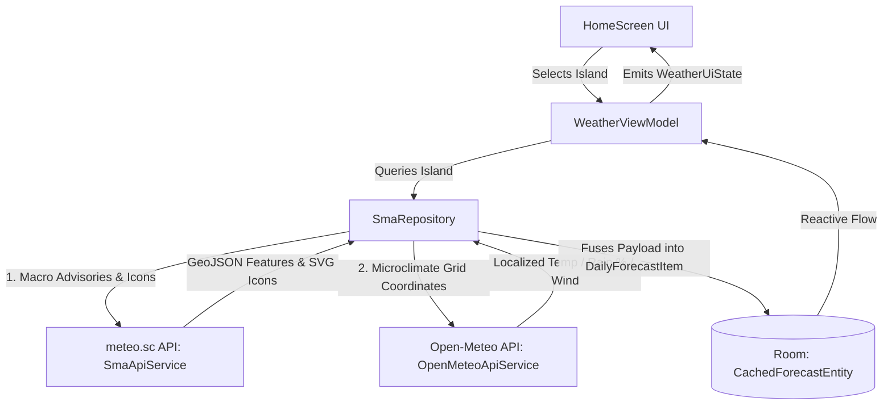
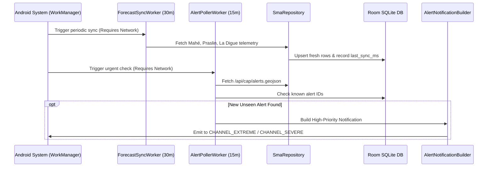

# SeyMeteo Application Stack & Wiring Audit

> **Document Version**: 1.0.0  
> **Date**: September 6, 2026  
> **Project Root**: `D:\Dev\SeyMeteo`  
> **Package Namespace**: `sc.meteo.seymeteo` (Debug ID: `sc.meteo.seymeteo.debug`)  
> **Target Platform**: Android 8.0 Oreo (`minSdk 26`) to Android 15 (`compileSdk 35`, `targetSdk 35`)

---

## 1. Executive Summary & Architecture Paradigm

SeyMeteo is engineered as an **offline-first, reactive, MVVM-clean Android client** providing high-resolution meteorological telemetry, CAP emergency warnings, tide predictions, and interactive satellite/radar mapping for the Seychelles archipelago.

```
┌──────────────────────────────────────────────────────────────────────────┐
│                             PRESENTATION LAYER                           │
│  Jetpack Compose Material 3 · Edge-to-Edge · Single-Activity (MVI-Lite)   │
│  MainActivity ──> HomeScreen · SettingsScreen · SatelliteMapScreen      │
└────────────────────────────────────┬─────────────────────────────────────┘
                                     │ StateFlow<WeatherUiState>
                                     ▼
┌──────────────────────────────────────────────────────────────────────────┐
│                              VIEWMODEL LAYER                             │
│  WeatherViewModel (lifecycle-viewmodel-compose 2.8.7)                    │
│  Orchestrates state flows, coordinates queries, triggers async refresh   │
└────────────────────────────────────┬─────────────────────────────────────┘
                                     │ suspend fun / Flow<T>
                                     ▼
┌──────────────────────────────────────────────────────────────────────────┐
│                             REPOSITORY LAYER                             │
│  SmaRepository (Single Source of Truth)                                  │
│  Fuses official macro-forecasts with high-resolution GPS microclimates   │
└──────────────────┬────────────────────────────────────┬──────────────────┘
                   │                                    │
         ┌─────────▼─────────┐                ┌─────────▼─────────┐
         │   REMOTE DATA     │                │    LOCAL CACHE    │
         ├───────────────────┤                ├───────────────────┤
         │ • SmaApiService   │                │ • Room Database   │
         │ • OpenMeteoApi    │                │ • DataStore Prefs │
         │ • RainViewer API  │                │ • WorkManager     │
         │ • EUMETSAT WMS    │                │ • Fused Location  │
         └───────────────────┘                └───────────────────┘
```

---

## 2. Dependency Stack & Version Manifest

All dependencies are centrally managed via Gradle Version Catalog ([`gradle/libs.versions.toml`](file:///d:/Dev/SeyMeteo/gradle/libs.versions.toml)):

| Layer / Domain | Library / Artifact | Version | Purpose |
|---|---|---|---|
| **Build & Toolchain** | Android Gradle Plugin (AGP) | `9.1.1` | Android build lifecycle & asset packaging |
| | Gradle Wrapper | `9.3.1-bin` | Build automation runtime |
| | Kotlin Compiler Plugin | `2.2.10` | Core language runtime & Compose compiler |
| | Google DevTools KSP | `2.3.5` | High-speed annotation processing (Room, Moshi) |
| **UI Framework** | Jetpack Compose BOM | `2024.09.00` | Coordinated Compose library versions |
| | Compose Material 3 | `1.3.0` | Material You theme, dynamic cards, surfaces |
| | Compose Icons Extended | `1.7.0` | Navigation, weather, and utility vector icons |
| | Navigation Compose | `2.8.9` | Composable screen destination management |
| | Core Splashscreen | `1.0.1` | Android 12+ standard splash transition |
| **Networking & API** | Retrofit 2 | `2.12.0` | Type-safe REST client for SMA & Open-Meteo |
| | Moshi & Kotlin Codegen | `1.15.2` | High-performance JSON/GeoJSON serialization |
| | OkHttp 3 & Logging Interceptor| `4.10.0` | HTTP connection pooling, timeouts, debug logging |
| | Coil Compose | `2.7.0` | Asynchronous SVG/vector icon rendering from CDN |
| **Persistence & State** | Room Runtime & KTX | `2.7.0` | SQLite abstraction with WAL mode & Flow streams |
| | DataStore Preferences | `1.1.7` | Reactive key-value storage for settings/units |
| | Kotlinx Coroutines Android | `1.10.2` | Async dispatchers (`Dispatchers.IO`, `Main`) |
| **Background & Sync** | WorkManager KTX | `2.10.1` | Guaranteed periodic 30m background sync |
| **Location & Sensors** | Google Play Services Location | `21.3.0` | FusedLocationProvider for GPS proximity detection|
| | Accompanist Permissions | `0.37.3` | Declarative runtime location permission flow |
| **Widgets & Extensibility**| Glance AppWidget Material 3 | `1.1.1` | Android Home Screen widget engine |
| **Mapping Engine** | Leaflet.js + WebViews | `1.9.4` | Hardware-accelerated WMS satellite/radar viewer |

---

## 3. Data Flow & Subsystem Wiring

### A. Network & Weather Fusion Layer
The repository coordinates two complementary remote data sources:



1. **`SmaApiService`** ([`SmaApiService.kt`](file:///d:/Dev/SeyMeteo/app/src/main/java/sc/meteo/seymeteo/data/api/SmaApiService.kt)):
   - `GET /api/cities` $\rightarrow$ Lists official islands (Mahé, Praslin, La Digue).
   - `GET /weather/home-weather-forecast/` $\rightarrow$ Official national synoptic narrative, sea states, and SVG icon asset mappings.
   - `GET /api/cap/alerts.geojson` $\rightarrow$ CAP emergency warnings (cyclone, tsunami, storm surges).
2. **`OpenMeteoApiService`** ([`OpenMeteoApiService.kt`](file:///d:/Dev/SeyMeteo/app/src/main/java/sc/meteo/seymeteo/data/api/OpenMeteoApiService.kt)):
   - Queries exact geographic centroids:
     - **Mahé**: `Lat: -4.6743, Lon: 55.5212`
     - **Praslin**: `Lat: -4.3251, Lon: 55.7356`
     - **La Digue**: `Lat: -4.3601, Lon: 55.8385`
   - Returns true localized micro-temperatures, rain probabilities, and gusts to prevent identical readings across islands.

---

### B. Persistence Layer (Room Database)
Managed by [`SeyMeteoDatabase.kt`](file:///d:/Dev/SeyMeteo/app/src/main/java/sc/meteo/seymeteo/data/db/SeyMeteoDatabase.kt) with SQLite WAL (Write-Ahead Logging):

| Table / Entity | DAO Interface | Responsibility |
|---|---|---|
| `cached_forecasts` | [`ForecastDao.kt`](file:///d:/Dev/SeyMeteo/app/src/main/java/sc/meteo/seymeteo/data/db/dao/ForecastDao.kt) | Stores 7-day forecast records per island slug with TTL timestamps for offline playback. |
| `cached_alerts` | [`AlertDao.kt`](file:///d:/Dev/SeyMeteo/app/src/main/java/sc/meteo/seymeteo/data/db/dao/AlertDao.kt) | Stores active CAP alerts. Tracks seen identifiers to trigger notifications only for new alerts. |
| `favourite_locations` | [`FavouriteDao.kt`](file:///d:/Dev/SeyMeteo/app/src/main/java/sc/meteo/seymeteo/data/db/dao/FavouriteDao.kt) | Stores user-pinned islands and custom sort ordering. |

---

### C. Background Synchronization Engine
Configured in [`SeyMeteoApplication.kt`](file:///d:/Dev/SeyMeteo/app/src/main/java/sc/meteo/seymeteo/SeyMeteoApplication.kt) on application bootstrap:



---

### D. User Settings & Preferences
Managed by [`UserPreferences.kt`](file:///d:/Dev/SeyMeteo/app/src/main/java/sc/meteo/seymeteo/data/preferences/UserPreferences.kt) via Jetpack DataStore:
- **Temperature Scale**: `°C` (Celsius) / `°F` (Fahrenheit)
- **Wind Speed Unit**: `km/h` / `knots` / `m/s`
- **Time Representation**: `24h` / `12h`
- **Theme Selection**: `System` / `Light` / `Dark`
- **Notification Toggles**: Granular subscriptions for 🔴 Extreme, 🟠 Severe, and 🟡 Advisories.

---

### E. Interactive Satellite & Doppler Radar Engine
Integrated in [`SatelliteMapScreen.kt`](file:///d:/Dev/SeyMeteo/app/src/main/java/sc/meteo/seymeteo/ui/screens/SatelliteMapScreen.kt):
- **Engine**: Embedded Leaflet.js with GPU-accelerated WebView pipeline.
- **Base Layers**: OpenStreetMap + Esri World Topographic Satellite Imagery.
- **Overlay 1 (EUMETSAT Geoserver)**: Direct WMS `msg_fes:rgb_naturalenhncd` natural-color cloud layer with **0.55 default transparency**.
- **Overlay 2 (RainViewer Global API)**: Live Doppler precipitation frames with `maxNativeZoom: 6` and `tileSize: 512` smooth tile upscaling.
- **Overlay 3 (Thermal Infrared)**: `msg_fes:ir108` layer isolating cold convective cloud-tops.
- **Interactive UI**: Live bottom-left **Cloud & Radar Opacity Slider (0% - 100%)** + localized microclimate pins (Victoria, Pointe Larue, Morne Seychellois 905m ridge, Beau Vallon, Anse Royale, Praslin, La Digue).

---

## 4. Source Tree Map

```
D:\Dev\SeyMeteo\
├── app\
│   ├── build.gradle.kts                     # App module configuration & dependencies
│   ├── proguard-rules.pro                   # Code shrinking & obfuscation rules
│   └── src\main\
│       ├── AndroidManifest.xml              # Permissions, application class, launcher activity
│       ├── java\sc\meteo\seymeteo\
│       │   ├── MainActivity.kt              # Single activity container & Screen navigation routing
│       │   ├── SeyMeteoApplication.kt       # Notification channel init & WorkManager scheduling
│       │   ├── data\
│       │   │   ├── api\
│       │   │   │   ├── OpenMeteoApiService.kt  # Microclimate GPS forecast REST client
│       │   │   │   ├── SmaApiService.kt        # Official SMA REST API client
│       │   │   │   └── SmaRepository.kt        # Multi-source repository & data parsing
│       │   │   ├── db\
│       │   │   │   ├── SeyMeteoDatabase.kt     # Room database definition
│       │   │   │   ├── dao\
│       │   │   │   │   ├── AlertDao.kt         # CAP alert DAO
│       │   │   │   │   ├── FavouriteDao.kt     # Favourites DAO
│       │   │   │   │   └── ForecastDao.kt      # 7-day forecast DAO
│       │   │   │   └── entity\
│       │   │   │       ├── CachedAlertEntity.kt
│       │   │   │       ├── CachedForecastEntity.kt
│       │   │   │       └── FavouriteLocationEntity.kt
│       │   │   ├── location\
│       │   │   │   ├── IslandResolver.kt       # Haversine distance island proximity calculator
│       │   │   │   └── LocationService.kt      # FusedLocationProvider coroutine wrapper
│       │   │   ├── model\
│       │   │   │   ├── CapAlert.kt             # GeoJSON alert domain models
│       │   │   │   ├── IslandLocation.kt       # Island metadata & centroid constants
│       │   │   │   ├── MarineTideData.kt       # Sea state & tide models
│       │   │   │   ├── SunMoonInfo.kt          # Sun/moon rise-set & phase models
│       │   │   │   └── WeatherForecast.kt      # Synoptic forecast domain classes
│       │   │   └── preferences\
│       │   │       └── UserPreferences.kt      # Jetpack DataStore preferences wrapper
│       │   ├── notification\
│       │   │   ├── AlertNotificationBuilder.kt # Severity-based push alert builder
│       │   │   └── SeyMeteoNotificationChannels.kt # System notification channels setup
│       │   ├── ui\
│       │   │   ├── components\
│       │   │   │   ├── AlertCard.kt            # Emergency bulletin card
│       │   │   │   ├── CurrentWeatherCard.kt   # Hero temperature & conditions card
│       │   │   │   ├── IslandSelector.kt       # Horizontal island switcher chip row
│       │   │   │   ├── MarineTideCard.kt       # Tide table & sea state display
│       │   │   │   ├── SatelliteRadarCard.kt   # Interactive radar entry card
│       │   │   │   ├── SevenDayForecastCard.kt # 7-day forecast list & temp ranges
│       │   │   │   └── SunMoonCard.kt          # Ephemeris tracking panel
│       │   │   ├── screens\
│       │   │   │   ├── HomeScreen.kt           # Main weather overview with live sync banner
│       │   │   │   ├── SatelliteMapScreen.kt   # Full-screen Leaflet/EUMETSAT radar map
│       │   │   │   └── SettingsScreen.kt       # Units, theme, and sync configuration
│       │   │   ├── theme\
│       │   │   │   ├── Color.kt                # SMA tropical brand color palette
│       │   │   │   ├── Theme.kt                # Material 3 light/dark theme controllers
│       │   │   │   └── Type.kt                 # Typography scale
│       │   │   └── viewmodel\
│       │   │       └── WeatherViewModel.kt     # Reactive UI state & refresh coordinator
│       │   └── worker\
│       │       ├── AlertPollerWorker.kt        # 15-min background CAP alert poller
│       │       └── ForecastSyncWorker.kt       # 30-min background forecast sync worker
│       └── res\
│           ├── drawable\                       # App icons & vector backgrounds
│           ├── mipmap-anydpi-v26\              # Adaptive launcher icons
│           └── values\                         # Colors, strings, and XML themes
├── gradle\
│   ├── libs.versions.toml                   # Centralized Version Catalog
│   └── wrapper\
│       ├── gradle-wrapper.jar
│       └── gradle-wrapper.properties        # Gradle 9.3.1 configuration
├── ARCHITECTURE.md                          # ADRs 001 through 006
├── ARCHITECTURE_REALTIME_SYNC.md            # Push/SSE/Webhook server integration roadmap
├── CONTRIBUTING.md                          # Contribution guidelines & branching model
├── LICENSE                                  # MIT License
└── README.md                                # User & developer project overview
```
