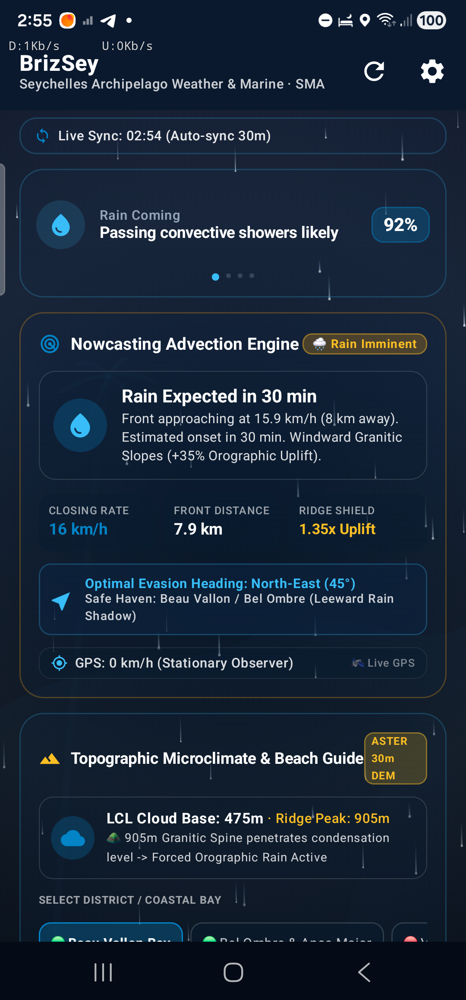
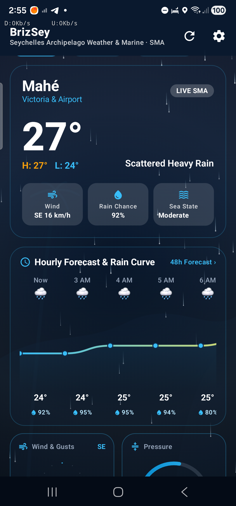
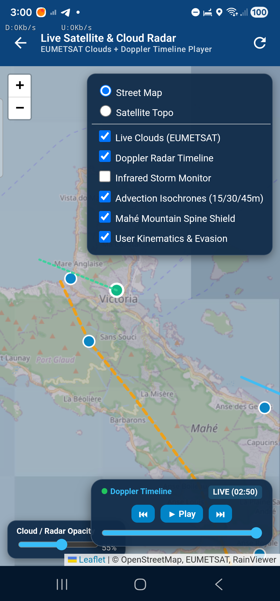
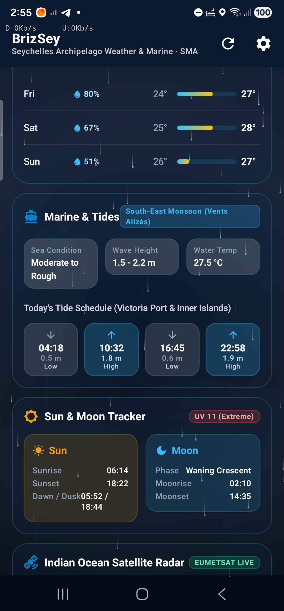
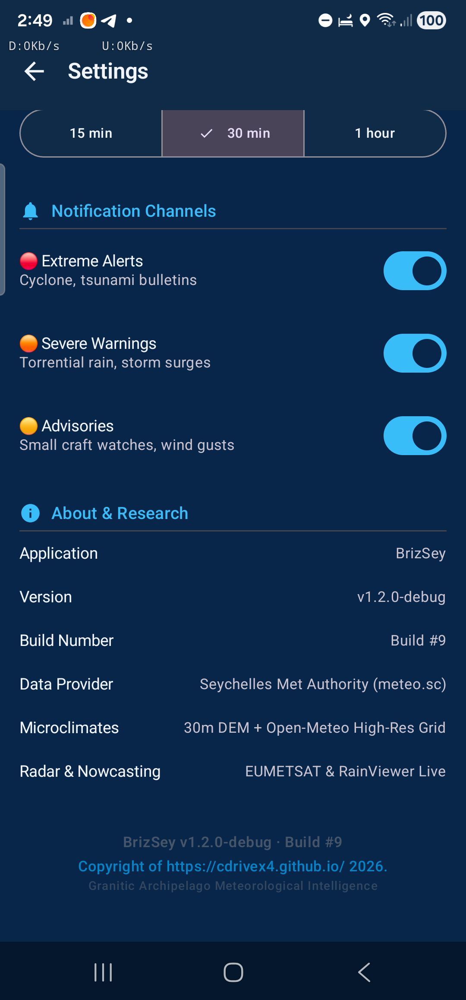

# BrizSey 🌤️🏝️

> A living, fluid glassmorphic weather and marine app for the Seychelles archipelago — inspired by *Vents Alizés* trade winds and built on the **Seychelles Meteorological Authority (SMA)** live API at [meteo.sc](https://www.meteo.sc).

[](https://android.com)
[](https://kotlinlang.org)
[](https://developer.android.com/jetpack/compose)
[-orange.svg)](https://developer.android.com/reference/android/os/Build.VERSION_CODES#O)
[](LICENSE)

---

## 📸 Application Showcase

| 🛰️ Live Nowcasting & GPS | 🏔️ 30m DEM Microclimates | 🗺️ Live Radar & Satellite Map |
| :---: | :---: | :---: |
|  |  |  |
| **Hardware GPS Kinematics & ETA** | **ASTER 30m DEM & LCL Cloud Base** | **12-Frame Doppler Timeline & Isochrones** |

| 🌊 Marine Swells & Tides | ⚙️ Cost-Loss & Build Info |
| :---: | :---: |
|  |  |
| **Swell Heights, Tides & Ephemeris** | **World Bank 11407 C/L & Build #9** |

---

## ✨ Core Features & Physical Capabilities

| Feature | Status |
|---------|--------|
| 7-day forecast (Mahé, Praslin, La Digue) | ✅ Live |
| Offline-first Room DB cache | ✅ Live |
| Topographic Microclimate & Beach Calmness Engine (DEM 30m) | ✅ Live |
| Lifting Condensation Level (LCL) Thermodynamic Piercing | ✅ Live |
| Leeward Rain Shadow & Windward Orographic Lift Predictor | ✅ Live |
| Coastal Safe Swimming & Wave Swell Guide (Beau Vallon, Anse Royale, etc.) | ✅ Live |
| Nowcasting Precipitation Advection & Dynamic Interception | ✅ Live |
| Atmospheric Predictability & Reassurance Gauge | ✅ Live |
| Cost-Loss Persona Alert Engine (World Bank 11407) | ✅ Live |
| 12-Frame Interactive Doppler Radar Timeline Player | ✅ Live |
| Home screen Glance widget | ✅ Live |
| Background auto-refresh (WorkManager) | ✅ Live |
| GPS auto-detect closest island & kinematic speed/heading | ✅ Live |
| Favourite locations system | ✅ Live |
| CAP severe weather alerts & local notifications | ✅ Live |
| Marine sea-state & tide overview | ✅ Live |
| Sun/moon rise-set info | ✅ Live |
| Satellite/radar preview with opacity controls | ✅ Live |
| Scientific Dissertation & Meteorological Model Paper | 📄 [Read Paper](doc/BRIZSEY_SCIENTIFIC_DISSERTATION.md) |
| Strategic AI & Future Roadmap | 🚀 [View Roadmap](TODO.md) |
| Developer & AI Handoff Guide | 🤝 [View Handoff Guide](HANDOFF.md) |
| Settings (°C/°F, wind units, theme, 12/24h, persona) | ✅ Live |
| Incremental Build Numbering & Copyright System | ✅ Live |
| Android 8.0 (API 26) through Android 15 support | ✅ Live |

---

## 🗺️ Live Weather Radar & Satellite Map Page

The interactive satellite and radar subsystem (`SatelliteMapScreen.kt`) provides meteorologists and islanders with a high-resolution, multi-layer GIS visualization:

<p align="center">
  
</p>

### Key Map Capabilities:
- **12-Frame Doppler Timeline Player**: Scrub through recent radar frames with automated play/pause, rewind, and fast-forward controls.
- **EUMETSAT Live Clouds & Infrared Storm Monitor**: Ingests real-time Indian Ocean cloud cover and storm convective tops.
- **Dynamic Advection Isochrones**: Renders 15-minute, 30-minute, and 45-minute projected rain front positions over the sea.
- **Granitic Mountain Spine Shield**: Displays the central ridge axis of Morne Seychellois ($905\,\text{m}$) color-coded by windward uplift and leeward rain shadow zones.
- **Live User Kinematics & Evasion Vector**: Displays the user's real-time hardware GPS location with dynamic heading arrows toward optimal leeward shelters.
- **Layer & Opacity Controls**: Seamless slider adjusting transparency between OpenStreetMap street tiles, satellite imagery, and radar precipitation echoes.

---

## 🏔️ Topographic Microclimate & Beach Calmness Engine

<p align="center">
  
</p>

- **Sub-Kilometer DEM Ingestion**: Bilinear interpolation over an embedded $64 \times 64$ elevation matrix (ASTER 30m / SRTM) spanning Mahé from sea level to 905m summit.
- **Lifting Condensation Level (LCL)**: Evaluates parcel condensation height $z_{\text{LCL}} \approx 125(T - T_d)\,\text{m}$ against the 905m Morne Seychellois ridge.
- **Orographic Lift Multiplier**: Calculates forced vertical velocity $\omega = \vec{v}_{\text{wind}} \cdot \nabla z$ producing $+35\%$ to $+85\%$ windward rainfall enhancement and $-50\%$ to $-80\%$ leeward Föhn rain shadows.
- **Hyper-Local Beach Guide**: Calculates Sverdrup-Munk-Bretschneider wave growth and fetch sheltering for 14 individual bays (Beau Vallon, Port Launay, Anse Royale, Takamaka, Grand Anse).

---

## 🛰️ Real-Time GPS Kinematics & Precipitation Advection

<p align="center">
  
</p>

- **100% Sensor-Driven**: Velocity vector, speed, heading, and accuracy are derived directly from the phone's Android `FusedLocationProviderClient`.
- **Automatic Scenario Switching**:
  - **Scenario A (Stationary Observer, $<2.0\,\text{km/h}$)**: Ray-casting boundary intersection calculates exact rain onset ETA and duration.
  - **Scenario B (Dynamic Observer, $\ge 2.0\,\text{km/h}$)**: Solves relative kinematic vector geometry $\vec{v}_{\text{rel}} = \vec{v}_{\text{front}} - \vec{v}_{\text{user}}$ to identify closing rates and safe-haven evasion routes.

---

## 🌊 Marine Sea-State, Swell & Tides

<p align="center">
  
</p>

- **Monsoonal Regime Tracking**: Automatic classification of *Vents Alizés* (SE Monsoon) vs *Vents du Nord-Ouest* (NW Monsoon).
- **Tide Schedule**: Real-time high/low tide predictions for Victoria Port and inner granitic islands.
- **Sun & Moon Celestial Ephemeris**: Golden hour, sunrise, sunset, moon phase, and UV index.

---

## ⚙️ Decision-Theoretic Settings & Build Info

<p align="center">
  
</p>

- **World Bank 11407 Cost-Loss Personas**: Tailors warning thresholds to user activity (Fisherman/Mariner $C/L=15\%$, Tourism/Excursion $C/L=50\%$, General Citizen $C/L=30\%$) to eliminate false-alarm fatigue.
- **Glass Translucency Controls**: Live slider adjusting atmospheric card opacity.
- **Incremental Build Tracking & Copyright Notice**: Displays `Build #9` and clickable copyright notice linking to `https://cdrivex4.github.io/`.

---

## 📜 Scientific Dissertation & Meteorological Model

BrizSey is built on a publication-grade scientific and meteorological framework documented in full in:

👉 **[BRIZSEY_SCIENTIFIC_DISSERTATION.md](doc/BRIZSEY_SCIENTIFIC_DISSERTATION.md)** — *Topographically-Resolved Microclimate Nowcasting, Dynamic Precipitation Interception, and Coastal Marine Dynamics for Granitic Tropical Archipelagos*.

This dissertation details:
- **Boundary Layer Thermodynamics**: Magnus-Tetens dew point formulation ($T_d$) and Lifting Condensation Level ($z_{\text{LCL}} \approx 125(T - T_d)\,\text{m}$) comparing cloud base against Mahé's 905m Morne Seychellois spine.
- **Forced Orographic Lift & Föhn Rain Shadows**: Kinematic surface velocity ($\omega = \vec{v}_{\text{wind}} \cdot \nabla z$) and adiabatic descent warming ($\Delta T \approx +3.89^\circ\text{C}$).
- **Froude Number Flow Regimes**: Atmospheric flow splitting around granitic obstacles ($Fr = U / (N \cdot h_m)$).
- **Coastal Marine Wave Generation**: Sverdrup-Munk-Bretschneider (SMB) shallow-water wave growth and topographic fetch sheltering.
- **Kinematic Nowcasting & Relative Evasion Vector Geometry**: $\vec{v}_{\text{rel}} = \vec{v}_{\text{front}} - \vec{v}_{\text{user}}$ solving for dynamic interception times and safe-haven corridors.
- **AI Foundation Models & Machine Learning Nowcasting**: Google DeepMind GraphCast, GenCast, MetNet-3, and DGMR neural radar ensembles.
- **Full Academic Bibliography**: 43 comprehensive, peer-reviewed scientific citations.

> ℹ️ **Documentation Synchronization Protocol**: Whenever project features, physical models, or domain logic are modified, [`doc/BRIZSEY_SCIENTIFIC_DISSERTATION.md`](doc/BRIZSEY_SCIENTIFIC_DISSERTATION.md) and [`HANDOFF.md`](HANDOFF.md) are maintained as core project documents and updated in tandem with codebase changes.

---

## 🚀 Strategic Roadmap & Advanced AI Innovations

Explore our comprehensive research and engineering roadmap in 👉 **[TODO.md](TODO.md)**:
- **Google DeepMind GraphCast / GenCast & MetNet-3**: On-premise GNN deployment at SMA downscaled to Mahé's 30m DEM for sub-kilometer microclimate resolution.
- **Deep Generative Radar Nowcasting (DGMR)**: High-resolution spatiotemporal precipitation probability grids $P(x,y,t)$ up to 6 hours ahead.
- **Commute & "Dry Corridor" Departure Optimizer**: Algorithmic solution to the optimal departure time problem $\min_\tau \mathcal{J}(\tau)$ advising commuters when to set out to avoid getting rained on.
- **Automated Broadcast Generative Video Reports**: Headless 3D topographic fly-overs with WMO meteorological symbols and neural multilingual voice synthesis (Creole, English, French).
- **Climate Change & SIDS Resilience**: Coral bleaching Degree Heating Weeks (DHW), tropical cyclone track genesis, and coastal inundation modeling under IPCC SSP scenarios.

---

## 🏗️ Architecture

SeyMeteo follows a clean **MVVM + Repository + Offline-First** architecture:

```
┌─────────────────────────────────────────────┐
│              UI Layer (Compose)              │
│  HomeScreen · SettingsScreen · Favourites   │
└──────────────────┬──────────────────────────┘
                   │ collectAsState / StateFlow
┌──────────────────▼──────────────────────────┐
│            ViewModel Layer                  │
│         WeatherViewModel (StateFlow)        │
└──────────────────┬──────────────────────────┘
                   │ suspend / Flow
┌──────────────────▼──────────────────────────┐
│            Repository Layer                 │
│   SmaRepository — single source of truth   │
│   FavouriteDao · ForecastDao · AlertDao     │
│   UserPreferences (DataStore)               │
└──────┬──────────────────────────────┬───────┘
       │ Retrofit                     │ Room
┌──────▼──────┐              ┌────────▼───────┐
│  SMA API    │              │  Local DB      │
│ meteo.sc    │              │  seymeteo.db   │
└─────────────┘              └────────────────┘
```

### Key Libraries

| Library | Purpose |
|---------|---------|
| Jetpack Compose + Material 3 | Modern declarative UI |
| Retrofit + Moshi | REST API calls + JSON parsing |
| Room | Local SQLite persistence (offline cache) |
| DataStore Preferences | User settings & build metadata |
| WorkManager | Periodic background sync |
| Coil | Async SVG/image loading from SMA CDN |
| Fused Location Provider | GPS kinematics & island auto-detection |
| Glance | Android home screen widget |

---

## 🚀 Getting Started

### Prerequisites

- Android Studio Hedgehog+ (or any IDE with Kotlin support)
- JDK 17+
- Android SDK API 26+ (Oreo)
- ADB (for sideloading to device)

### Build & Run

```bash
# Clone the repo
git clone https://github.com/cdrivex4/BrizSey.git
cd BrizSey

# Build debug APK
./gradlew assembleDebug

# Install on connected device
adb install -r app/build/outputs/apk/debug/app-debug.apk
```

### Build Variants

| Variant | Application ID | Description |
|---------|---------------|-------------|
| `debug` | `sc.meteo.seymeteo.debug` | Development, logging enabled |
| `release` | `sc.meteo.seymeteo` | Production, minified |

---

## 🌐 API

SeyMeteo consumes the **public SMA API** at `https://www.meteo.sc`. No API key is required — all endpoints are publicly accessible.

| Endpoint | Description |
|----------|-------------|
| `GET /api/cities` | Available island locations |
| `GET /weather/home-weather-forecast/` | 7-day forecast (GeoJSON FeatureCollection) |
| `GET /api/cap/alerts.geojson` | Active CAP severe weather alerts |
| `GET /api/home-map/settings` | Radar/satellite map layer config |

> **Note:** The SMA API does not require authentication for read access. Forecast data is returned for Mahé, Praslin, and La Digue.

---

## 📦 Project Structure

```
SeyMeteo/
├── app/
│   └── src/main/java/sc/meteo/seymeteo/
│       ├── data/
│       │   ├── api/           # Retrofit service + SmaRepository
│       │   ├── db/            # Room database, DAOs, entities
│       │   ├── location/      # GPS + island resolver
│       │   ├── model/         # Domain data classes & physics solvers
│       │   └── preferences/   # DataStore user settings
│       ├── notification/      # CAP alert notifications
│       ├── ui/
│       │   ├── components/    # Reusable Compose cards
│       │   ├── screens/       # HomeScreen, SatelliteMapScreen, SettingsScreen, etc.
│       │   ├── theme/         # Color, Type, Theme
│       │   └── viewmodel/     # WeatherViewModel
│       ├── widget/            # Glance home screen widget
│       └── worker/            # WorkManager background jobs
├── doc/
│   ├── BRIZSEY_SCIENTIFIC_DISSERTATION.md  # Meteorological dissertation
│   ├── Mahemaps/                           # Topographic DEM maps
│   └── screenshots/                        # Live application screenshots
├── TODO.md                                 # Strategic AI & feature roadmap
├── HANDOFF.md                              # Master AI developer handoff guide
├── version.properties                      # Incremental build & version configuration
├── gradle/
│   ├── libs.versions.toml     # Version catalog
│   └── wrapper/
├── api_discovery/             # Sample SMA API responses (dev reference)
└── decompiled_meteo_sez/      # JADX output of legacy app (reference only)
```

---

## 🤝 Contributing

See [CONTRIBUTING.md](CONTRIBUTING.md) for guidelines on branching, commit style, and pull requests.

---

## 📄 License

This project is licensed under the [MIT License](LICENSE). Weather data is provided by the Seychelles Meteorological Authority and remains their intellectual property.

---

## 🙏 Credits

- **Data Provider:** [Seychelles Meteorological Authority (SMA)](https://www.meteo.sc)
- **Original app inspiration:** _Meteo Sez_ by SMA (package `sc.gov.meteo`)
- **Radar & Satellite Data:** [RainViewer API](https://www.rainviewer.com/api.html) & [EUMETSAT IODC](https://www.eumetsat.int)
- **Icons:** SMA weather icon CDN + Material Symbols

---

> *"Beautiful islands deserve a beautiful weather app."* 🏝️
